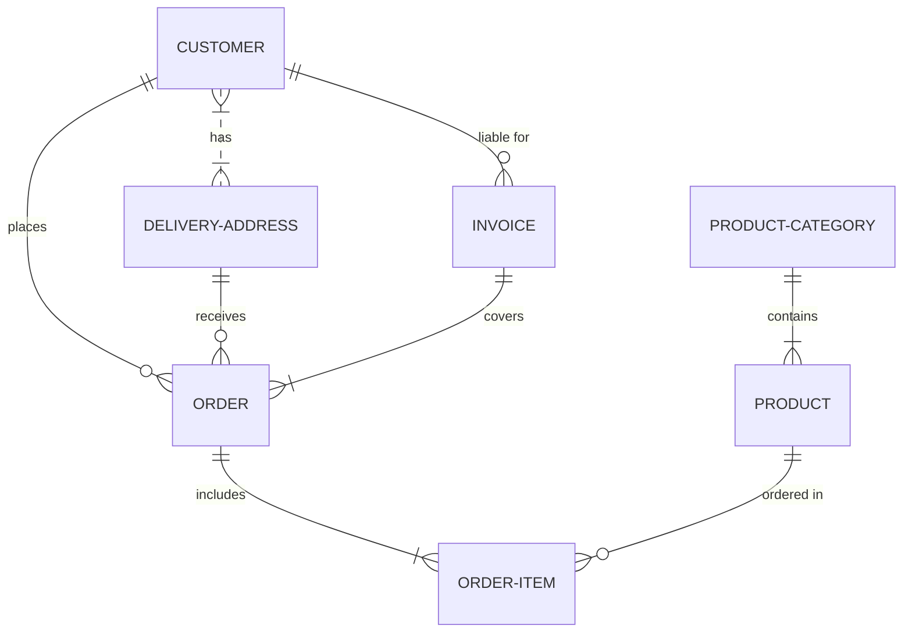

# Proyecto de Estudio!
    
**Estructura del documento principal:**

# PRESENTACIÓN (MyVet)

**Asignatura**: Bases de Datos I (FaCENA-UNNE)

**Integrantes**:
 - Coronel, Antonio.
 - Sed ac justo ac mauris porttitor convallis non sit amet felis.
 - In tincidunt augue sed molestie malesuada.

**Año**: 2025

## CAPÍTULO I: INTRODUCCIÓN

### Caso de estudio

El presente caso de estudio aborda el diseño y desarrollo de un sistema de gestión para una veterinaria. Este sistema permitirá administrar de manera centralizada la información de mascotas, propietarios, veterinarios, turnos, consultas médicas y vacunaciones, así como gestionar los distintos roles y permisos de usuario que interactúan con la aplicación.

El sistema busca optimizar el proceso de atención veterinaria y la gestión interna, permitiendo un manejo más eficiente y ágil de los datos relacionados con la salud de las mascotas y la organización de los turnos. La plataforma está orientada tanto a los veterinarios como al personal administrativo, brindando herramientas que faciliten la planificación de consultas, el seguimiento de tratamientos y vacunas, y el control del historial clínico de cada paciente.

### Definición o planteamiento del problema

El objetivo principal del sistema es resolver las dificultades que enfrentan mcuhas veterinarias debido a la ausencia de un sistema integrado que permita gestionar de manera eficiente las distintas áreas de atención y administración. Entre los problemas más comunes que se presentan se encuentran:

Registros dispersos o manuales: La información de mascotas, propietarios, consultas y vacunas suele estar fragmentada en planillas, archivos físicos o sistemas poco especializados, lo que incrementa el riesgo de pérdida de datos y errores administrativos.

Gestión ineficiente de turnos y consultas: La falta de un sistema organizado ocasiona solapamiento de horarios, cancelaciones mal registradas o dificultad para dar seguimiento al historial clínico de cada paciente.

Control limitado de tratamientos y vacunaciones: Sin un registro digital centralizado, resulta complejo llevar un seguimiento claro de vacunas aplicadas o tratamientos en curso, generando riesgos para la salud de las mascotas.

Problemas de trazabilidad en la atención médica: La ausencia de un historial clínico completo dificulta la toma de decisiones por parte de los veterinarios y limita la capacidad de personalizar la atención.

Falta de control de accesos y roles: Cuando diferentes usuarios (administrativos, veterinarios, recepcionistas) interactúan en el sistema sin un adecuado control de permisos, se generan problemas de seguridad y uso indebido de información sensible.

## CAPITULO II: MARCO CONCEPTUAL O REFERENCIAL

**TEMA 1 " ---- "** 
Ut sed imperdiet risus. Maecenas vestibulum arcu vitae orci pretium pharetra. Suspendisse potenti. Fusce massa libero, fermentum eget elit in, tincidunt fermentum nunc. Cras imperdiet nisl elit, elementum gravida enim accumsan vel. Sed in sapien quis ante consectetur commodo id non nulla. Aenean lacinia, dolor convallis semper mattis, ante orci elementum nunc, eget feugiat risus neque in urna. Ut ut quam nec risus mollis convallis ornare ac odio. Phasellus efficitur posuere nibh, eget tempor augue pellentesque ac. Ut enim sem, imperdiet non est ut, blandit posuere dui. Curabitur at purus orci. Interdum et malesuada fames ac ante ipsum primis in faucibus.

**TEMA 2 " ----- "** 
Ut sed imperdiet risus. Maecenas vestibulum arcu vitae orci pretium pharetra. Suspendisse potenti. Fusce massa libero, fermentum eget elit in, tincidunt fermentum nunc. Cras imperdiet nisl elit, elementum gravida enim accumsan vel. Sed in sapien quis ante consectetur commodo id non nulla. Aenean lacinia, dolor convallis semper mattis, ante orci elementum nunc, eget feugiat risus neque in urna. Ut ut quam nec risus mollis convallis ornare ac odio. Phasellus efficitur posuere nibh, eget tempor augue pellentesque ac. Ut enim sem, imperdiet non est ut, blandit posuere dui. Curabitur at purus orci. Interdum et malesuada fames ac ante ipsum primis in faucibus.

...

## CAPÍTULO III: METODOLOGÍA SEGUIDA 

Donec lobortis tincidunt erat, non egestas mi volutpat in. Cras ante purus, luctus sed fringilla non, ullamcorper at eros.

 **a) Cómo se realizó el Trabajo Práctico**
Vestibulum rutrum feugiat molestie. Nunc id varius augue. Ut augue mauris, venenatis et lacus ut, mattis blandit urna. Fusce lobortis, quam non vehicula scelerisque, nisi enim ultrices diam, ac tristique libero ex nec orci.

 **b) Herramientas (Instrumentos y procedimientos)**
Donec lobortis tincidunt erat, non egestas mi volutpat in. Cras ante purus, luctus sed fringilla non, ullamcorper at eros. Integer interdum id orci id rutrum. Curabitur facilisis lorem sed metus interdum accumsan. 

## CAPÍTULO IV: DESARROLLO DEL TEMA / PRESENTACIÓN DE RESULTADOS 

Maecenas molestie lacus tincidunt, placerat dolor et, ullamcorper erat. Mauris tortor nisl, ultricies ac scelerisque nec, feugiat in nibh. Pellentesque interdum aliquam magna sit amet rutrum. 

### Diagrama conceptual (opcional)
Ejemplo usando Live Editor https://mermaid.js.org/ (ejemplo opcional)

### Diagrama relacional

### Diccionario de datos

Acceso al documento [PDF](doc/diccionario_datos.pdf) del diccionario de datos.

### Desarrollo TEMA 1 "----"

Fusce auctor finibus lectus, in aliquam orci fermentum id. Fusce sagittis lacus ante, et sodales eros porta interdum. Donec sed lacus et eros condimentum posuere. 

> Acceder a la siguiente carpeta para la descripción completa del tema [scripts-> tema_1](script/tema01_nombre_tema)

### Desarrollo TEMA 2 "----"

Proin aliquet mauris id ex venenatis, eget fermentum lectus malesuada. Maecenas a purus arcu. Etiam pellentesque tempor dictum. 

> Acceder a la siguiente carpeta para la descripción completa del tema [scripts-> tema_2](script/tema02_nombre_tema)

... 

## CAPÍTULO V: CONCLUSIONES

Nunc sollicitudin purus quis ante sodales luctus. Proin a scelerisque libero, vitae pharetra lacus. Nunc finibus, tellus et dictum semper, nisi sem accumsan ligula, et euismod quam ex a tellus. 

## BIBLIOGRAFÍA DE CONSULTA

 1. List item
 2. List item
 3. List item
 4. List item
 5. List item

